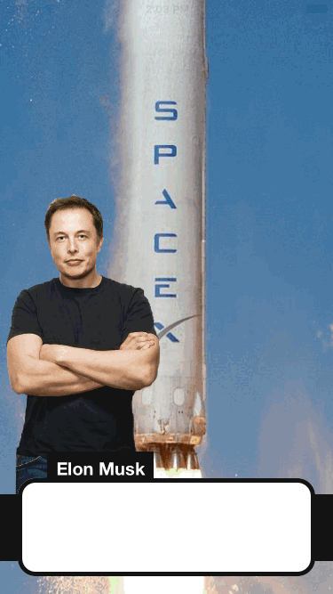
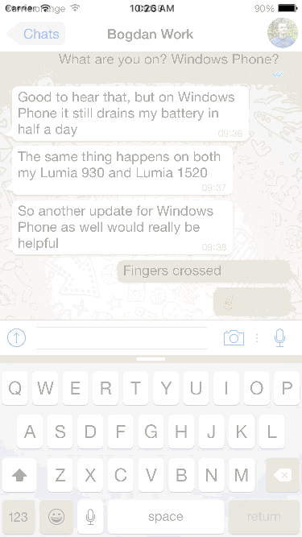
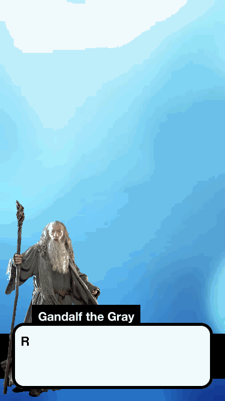

# EZText.Space

Website: http://eztext.space




## Easy to use:
```swift
let name = "Doctor Amy"
let text = "Hello my name is Doctor Amy, I will show you how to use this library."
let image = UIImage(named: "doctor")!
let imageLocation = EZTextSpaceImageStartLocation.TopOfBlack
EZTextSpace.show(name, text: text, image: image, imageLocation: imageLocation, onClick: { () -> () in
   EZTextSpace.hide() 
})
```

## Editing:
```swift
EZTextSpace.Settings.padding = 40
EZTextSpace.Settings.height = 400
EZTextSpace.Settings.textSpeed = 0.5 // Characters per second
```

|Settings Options|
| -------------|
|padding|
|height|
|textSpeed|

## No object tracking:
EZTextSpace is a singleton object so you don't need to keep track of its instance or anything. Just show than hide.  

##Installation (~10 seconds)

1. Download and drop 'EZTextSpace.swift' in your project.  
2. Congratulations!  

## Install via CocoaPods

You can use [Cocoapods](http://cocoapods.org/) to install `EZTextSpace` by adding it to your `Podfile`:

```ruby
platform :ios, '8.0'
use_frameworks!

pod 'EZTextSpace'
```

Then on the top of files where you are going to use this:

```swift
import EZTextSpace
```

##Requirements

- Xcode 6 or later (Tested on 7.2)
- iOS 7 or later (Tested on 9.2)

##Possible features

- More customization
- Pod support 
- More examples
- Update without resetting the view
- Option to allow the background app to be clicked
- Horizontal option
- Show the person at the right option
- OSX compatibility

##License
EZTextSpace is available under the MIT license. See the [LICENSE file](https://github.com/goktugyil/EZText.Space/blob/master/LICENSE).

##Other Fun Gifs





##Keywords
swift, text, message, conversation, speech, dialog, dialogue, rpg, jrpg, game, rick and morty,
